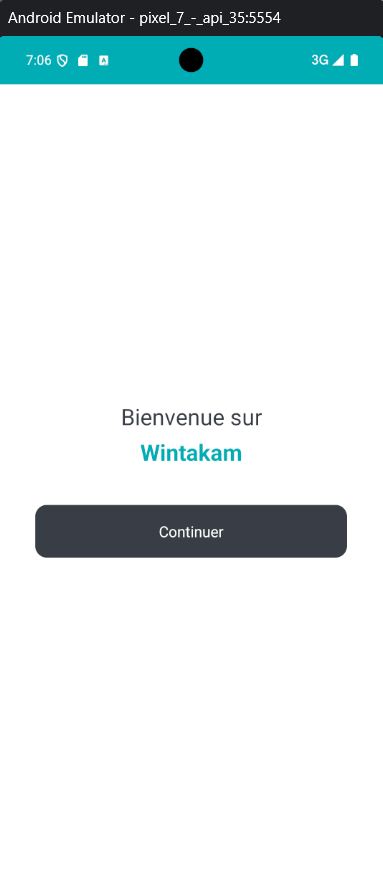
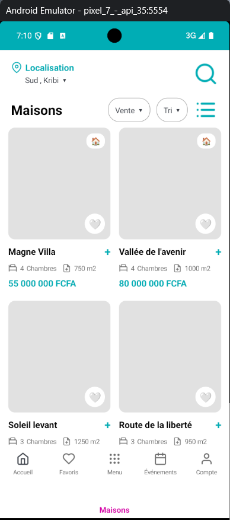
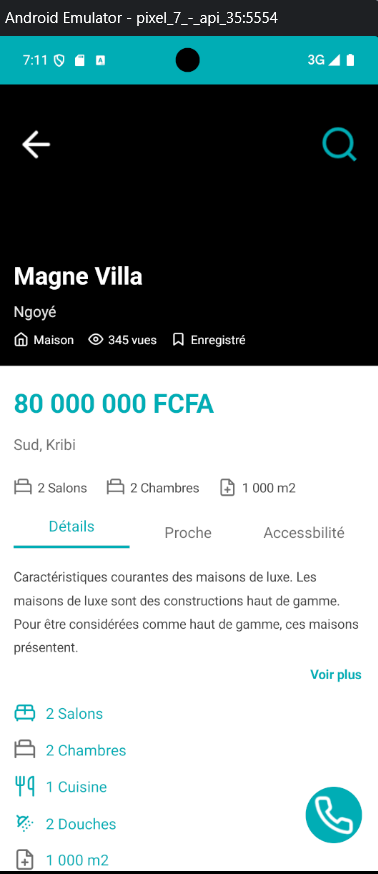

# Wintakam

A modern cross-platform real estate mobile application built with .NET MAUI, designed to help users discover, browse, and explore property listings.



## Overview

Wintakam is a comprehensive real estate platform that allows users to browse property listings, view detailed information about houses, and manage their favorite properties. The application features a clean, modern UI with location-based search capabilities and detailed property information.

## Features

- **User Authentication**: Secure login with email/password or social authentication (Google, Facebook)
- **Property Listings**: Browse a curated list of available properties with key details
- **Advanced Filtering**: Filter properties by sale/rent type, sort options, and location
- **Detailed Property Views**: View comprehensive information including:
  - Number of bedrooms, bathrooms, and living rooms
  - Property size in square meters
  - Price in FCFA
  - Detailed descriptions and characteristics
  - Multiple property images
- **Favorites Management**: Save and manage favorite properties
- **Location-Based Search**: Search properties by location
- **Bottom Navigation**: Quick access to Home, Favorites, Menu, Events, and Account sections

## Screenshots

| Welcome | Login | Listings | Details |
|---------|-------|----------|---------|
|  |  |  |  |

## Design

The application design is available on Figma:
[View Design on Figma](https://www.figma.com/design/Sb3BKgotZ3hkRzKuGn2t6F/M2---Dev-Mobile?node-id=0-1&p=f&t=ZREHNqNDB8hZ1T9k-0)

## Platform Support

Wintakam is built with .NET MAUI and supports multiple platforms:

- **Android** (API 21+)
- **iOS** (iOS 15.0+)
- **macOS Catalyst** (macOS 15.0+)
- **Windows** (Windows 10.0.19041.0+)

## Technology Stack

- **.NET 9.0**: Latest .NET platform
- **.NET MAUI**: Multi-platform App UI framework
- **C# 12**: With nullable reference types
- **XAML**: For UI markup
- **Shell Navigation**: Modern navigation pattern

## Getting Started

### Prerequisites

- [.NET 9.0 SDK](https://dotnet.microsoft.com/download/dotnet/9.0)
- Visual Studio 2022 (17.8+) or Visual Studio Code
- Platform-specific requirements:
  - **Android**: Android SDK (API 21+)
  - **iOS/macOS**: Xcode 15+
  - **Windows**: Windows 10 SDK (10.0.19041.0+)

### Installation

1. Clone the repository:
```bash
git clone https://github.com/yourusername/wintakam.git
cd wintakam
```

2. Restore dependencies:
```bash
dotnet restore Wintakam.csproj
```

3. Build the project:
```bash
dotnet build Wintakam.csproj
```

### Running the Application

#### Android
```bash
dotnet run -f net9.0-android
```

#### iOS
```bash
dotnet run -f net9.0-ios
```

#### Windows
```bash
dotnet run -f net9.0-windows10.0.19041.0
```

#### macOS Catalyst
```bash
dotnet run -f net9.0-maccatalyst
```

## Project Structure

```
Wintakam/
├── Platforms/          # Platform-specific code
│   ├── Android/
│   ├── iOS/
│   ├── MacCatalyst/
│   └── Windows/
├── Resources/          # Application resources
│   ├── AppIcon/       # App icons
│   ├── Splash/        # Splash screens
│   ├── Images/        # Image assets
│   ├── Fonts/         # Custom fonts
│   └── Styles/        # XAML styles
├── Docs/              # Documentation and images
│   └── Images/        # Screenshot images
├── App.xaml           # Application entry point
├── AppShell.xaml      # Shell navigation container
├── MainPage.xaml      # Main page
└── MauiProgram.cs     # App configuration
```

## Architecture

The application follows the .NET MAUI Single Project architecture pattern:

- **Shell Navigation**: Uses AppShell for navigation and routing
- **MVVM Pattern**: Separation of UI and business logic
- **Dependency Injection**: Built-in DI container for services
- **Platform-Specific Code**: Organized in the Platforms directory

## Development

### Adding New Pages

1. Create a new ContentPage (e.g., `NewPage.xaml` and `NewPage.xaml.cs`)
2. Register the page route in `AppShell.xaml.cs`:
```csharp
Routing.RegisterRoute("newpage", typeof(NewPage));
```
3. Navigate using:
```csharp
await Shell.Current.GoToAsync("newpage");
```

### Registering Services

Add services in `MauiProgram.cs`:
```csharp
builder.Services.AddSingleton<IMyService, MyService>();
builder.Services.AddTransient<MyPage>();
builder.Services.AddTransient<MyViewModel>();
```

## Building for Production

### Android
```bash
dotnet publish -f net9.0-android -c Release
```

### iOS
```bash
dotnet publish -f net9.0-ios -c Release
```

### Windows
```bash
dotnet publish -f net9.0-windows10.0.19041.0 -c Release
```

## Contributing

Contributions are welcome! Please feel free to submit a Pull Request.

## License

This project is licensed under the MIT License - see the LICENSE file for details.

## Acknowledgments

- Design created with Figma
- Built with .NET MAUI
- Icons and resources from the .NET MAUI community

## Contact

For questions or support, please open an issue in the GitHub repository.

---

**Note**: Before publishing to production, make sure to:
- Update the Application ID from `com.companyname.wintakam` to your own
- Configure proper authentication endpoints
- Set up backend API connections
- Update privacy policy and terms of service
- Configure proper signing certificates for app stores
